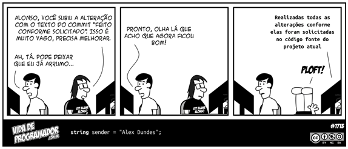

Uma das coisas mais difíceis que me deparei quando entrei no mundo da programação, foi conseguir trabalhar em equipe num mesmo repositório do GitHub. No começo foi uma verdadeira loucura!

Não tínhamos ainda uma boa forma de escrever as mensagens dos commits. Cada pessoa escrevia da maneira que queria, como usar palavras soltas, mensagens sem boa descrição ou clareza sobre o que havia sido feito ou até mesmo escrevíamos frases sobre nosso estado humor.

E isso acarretou em diversos problemas tanto na entrega de projetos devido ao retrabalho, quanto na motivação da equipe que ficava exausta de ter que fazer tudo de novo. Resolvemos acabar de vez com esses problemas e é sobre isso que vamos falar hoje.

## Padronizar os commits

Muitas vezes tudo que queremos é desabafar no commit depois de uma batalha travada para conseguir resolver um problema no código, mas acredite não é a melhor opção quando no futuro se precisar descobrir o que foi que você fez naquele commit.

Print de commits errados.

Na hora você realmente não percebe que está se metendo em um problema, mas quando seu colega de trabalho joga um commit por cima do seu, causando problemas nas suas modificações e você precisa voltar a um commit para salvar todo seu trabalho do dia e não tem a menor ideia do commit que precisa restaurar é que cai a ficha do problemasso que você criou.

Tirinha mensagem do commit by [Vida de Programador](https://vidadeprogramador.com.br/2017/07/19/mensagem-do-commit/)

Padronizar os commits é uma saída muito simples e importante quando se trabalhar em equipe. Todos precisam entender o que foi feito e ter uma rápida compreensão no processo de revisão, para retornar caso ocorra algum problema e até mesmo para futuras manutenções. Vamos ver então as melhores formas de enviar esses commits de forma clara, objetiva e padronizada.

É imprescindível que essa padronização seja acordada entre todos da equipe. Encontrem uma forma que facilite a comunicação e o entendimento de cada um que terá contato com o repositório.

## Dicas de padronização de commits

Algumas formas de padronizar as mensagens de commit são:

Limitar a quantidade de caracteres – uma mensagem muito grande pode fazer você se perder;

PS: o commit ficou tão grande que terminou embaixo. Não faça isso nunca! Never!!!

Iniciar com um verbo – a forma deve ser acordada entre a equipe:
Pode ser no gerúndio (atualizando, criando, alterando)

Pode ser no infinitivo (atualizar, criar, alterar)

Pode ser substantivo derivado de verbo (atualização, criação, alteração)

Usar palavras chaves que direcionam qualquer pessoa, mesmo quem nunca tenha visto o projeto, a entender o que foi feito – “atualizar home design 1sti”, fica claro que a home foi atualizada para o design da 1sti.

## GITFLOW

Mais uma coisa que precisamos saber quando trabalhamos em equipe, é usar padrão de organização de branches. Escolhemos usar o Git Flow, existem outras opções, mas essa é, hoje, a forma mais conhecida. Ao fazer o fork de um projeto para nossa máquina é fundamental que tenhamos um remote com o link para o projeto original, dessa forma sempre que outra pessoa enviar um commit para a master podemos atualizar nossa branch e seguir codando sem que ocorra conflitos.

Não usar o [git flow](https://fjorgemota.com/git-flow-uma-forma-legal-de-organizar-repositorios-git/) corretamente foi outro erro que cometemos diversas vezes. Costumávamos esquecer de criar um remote para o projeto original, não tínhamos o cuidado de usar o comando git pull para atualizar o repositório antes de enviar novas atualizações de código, jogávamos um código por cima do outro e quando o colega ia ver tinha apagado o do outro. Um verdadeiro caos. E aprender a usar essa ferramenta foi importantíssimo para nós.

## Concluindo

Conseguimos melhorar muito o nosso trabalho no dia a dia, ao tomar o cuidado de manter o repositório de trabalho sempre atualizado, criando branches de maneira organizada, escrevendo os comentários de cada commit clara e objetivamente para que qualquer pessoa seja capaz de compreender, que podem evitar diversos problemas futuros na nossa caminhada tecnológica.