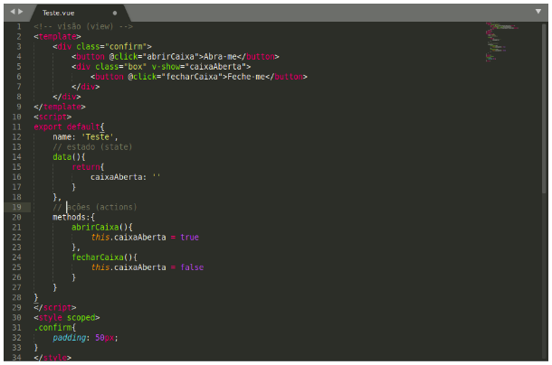
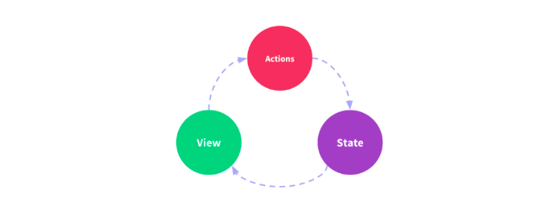
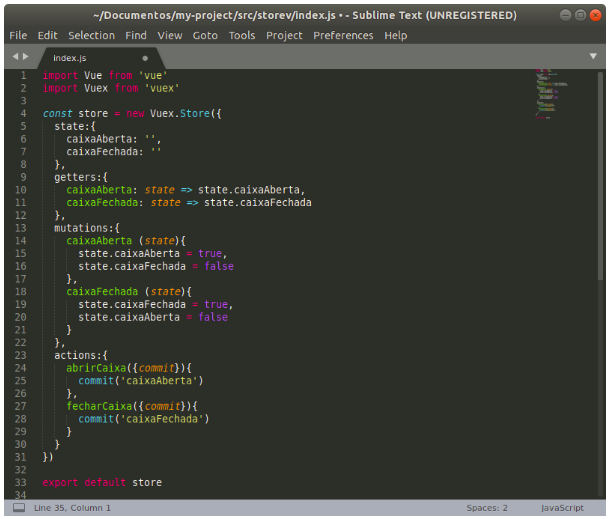
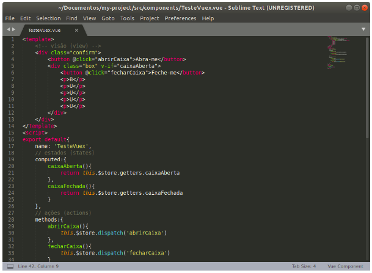

Há momentos em uma aplicação SPA (Single Page Application) que você pode se encontrar em um beco sem saída quando suas funcionalidades começam a dar conflito e não funcionam.

É muito complicado conseguir gerenciar os estados de uma aplicação quando existe a mesma ação em mais de um componente que aparecem ao mesmo tempo na tela. Para nos ajudar nessa difícil tarefa existe o Vuex.

Vuex é um padrão de gerenciamento de estado para aplicativos feitos em Vue.js. Ele é o local onde conseguimos centralizar o armazenamento desses estados, que poderá ser usado por todos os componentes da aplicação, garantindo que as modificações ocorram de forma previsível.

## Padrão de Gerenciamento de Estado

Quando criamos uma aplicação básica em vue que tenha, por exemplo, apenas um componente com dois botões, um de abrir e um de fechar, essa aplicação possui as seguintes partes:

<strong>Visão (view) -</strong> onde conseguimos visualizar os estados;

<strong>Estado (state) -</strong> fonte de verdades que vai direcionar nossa aplicação;

<strong>Ação (action) -</strong> possíveis mudanças que o estado poderá sofrer de acordo com a interação do usuário com a visão.

Bem simples, não??? Imagine agora que tenhamos mais um componente e que esse novo componente utilize os mesmos botões em sua interface. Poderia ocorrer erros como o elemento não abrir corretamente no segundo componente, ou dar conflitos que confundam o desenvolvimento da aplicação, além de realmente não funcionarem em alguns casos, o que é realmente, muito, muito ruim. Eu tive essa experiência recentemente e por isso decidi buscar outro caminho.

Existe um padrão possível em que podemos gerenciá-los de forma global e permitir que qualquer componente da aplicação possa acessar os estados ou modificá-los através de ações. Você deve está se perguntando o que pode ser isso, não é mesmo?? E a resposta é exatamente o título desse artigo: o VUEX.

## Instalando o Vuex

Para instalar o Vuex, basta usar o comando “npm install vuex --save” no terminal.

## Usando Vuex

Nas aplicações com Vuex existe o store, que é, de forma bem simples, um recipiente onde guardamos o estado que queremos ou os módulos se estivermos trabalhando dessa forma. O store se caracteriza por:

1. Eles são reativos, então quando os componentes recebem um estado dele, eles atualizarão se o estado do store mudar;

2. Não se deve alterar diretamente um estado do store, uma maneira de fazer isso é confirmando (fazendo commit) mutações. Isso garante que essas mudanças deixem um registro que seja rastreável.

## Criando uma Store

Depois de feita a instalação do Vuex, vamos criar um store fornecendo um estado inicial, algumas mutações e ações.

Aqui nós começamos importando vue e vuex para o arquivo e criando o store, que é o nosso recipiente. Dentro do store colocamos tudo que precisamos para fazer nossos botões abrirem e fecharem os elementos. Iniciamos com o state, que funciona como nosso data e colocaremos nossas variáveis, tomaremos o cuidado de usar substantivos para nomeá-las, pois são estados.

Agora temos uma novidade que é o getter, que nos oferece uma forma de disponibilizar esse estado para usar nos componentes. Com os getters prontos, criamos as mutations, onde podemos modificar nossos estados.

Feito tudo isso, vamos então para as actions, onde criaremos os commits que acionam as nossas mutations e confirmam as mudanças.

Para receber um estado no componente, precisamos antes de tudo chamar os getters que criamos, usando então o computed, que nos permite definir uma propriedade da mesma maneira que no data, mas que também permite receber lógica. Para usá-los temos que acessar o store e os getters que criamos indicando dentro do computed o caminho até chegar nos nossos estados, caixaAberta e caixaFechada.

Criamos um methods para acionar as actions. Dentro de methods iniciamos com os nomes das funções que serão usadas aqui, para não ficar muita informação usaremos os mesmos nomes que utilizamos nas actions, lembrando de sempre utilizar verbos, porque são ações. As actions são acionadas usando o store.dispatch e chamamos as actions.

Nossos métodos estão prontos para serem usados! E podem ser chamados onde precisamos, nesse exemplo, usamos com o @click nos botões e voilà, nossos botões estão funcionando.

Se você está trabalhando em uma aplicação de médio a grande porte, você pode criar um sistema de módulos dentro da store, onde cada módulo pode conter seus próprios estados, mutações e ações. Falaremos sobre isso em um próximo artigo.

## Usar ou não usar??

Embora o Vuex ajude de forma muito eficiente no gerenciamento de estado compartilhado, ele vem com mais conceitos que deverão ser empregues e muito código repetitivo o que pode parecer deixá-lo mais complicado. Então se você está fazendo uma aplicação simples, pode considerar não fazer uso dele.

Mas se você está construindo uma aplicação que precisa compartilhar muitos estados entre os componentes, será muito melhor gerenciá-los de forma centralizada, pois provavelmente você vai se deparar com os conflitos e bugs que podem surgir com o crescimento do projeto.

Se quiser conhecer um pouco mais do assuntos, pode acessar a documentação da própria [biblioteca](https://vuex.vuejs.org/ptbr/).
